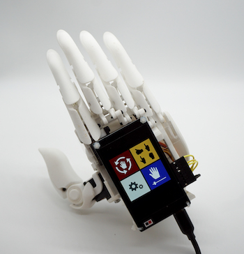

# Hackberry Hand Project

Copyright 2020 Moddable Tech, Inc.<BR>
Revised: March 20, 2020



This repository contains materials related to the Hackberry hand project by Moddable.

- The [`assembly`](./assembly) directory contains instructions to assemble the hand
- The [`app`](./app) directory contains the source code for the application

<!--For video demonstrations and more information about this project, see [this blog post]().-->

## Software Instructions

You can run the Hackberry hand application on an actual device or on the Moddable hardware simulator. Instructions to run the application on each target platform are provided below.

### Device

1. Install the Moddable SDK. Follow the instructions in the **Host environment setup** and **ESP32 setup** sections for your computer's operating system in the [Getting Started guide](https://github.com/Moddable-OpenSource/moddable/blob/public/documentation/Moddable%20SDK%20-%20Getting%20Started.md).

2. Clone this repository.

	```text
	git clone https://github.com/Moddable-OpenSource/hackberry-hand.git
	```

3. Plug your device in to your computer using a micro USB cable and Moddable programmer.

4. Navigate to the `app` directory and install the application using `mcconfig`.
	
	```text
	cd hackberry-hand/app
	mcconfig -d -m -p esp32/moddable_two
	```
	
### Simulator

1. Install the Moddable SDK. Follow the instructions in the **Host environment setup** section for your computer's operating system in the [Getting Started guide](https://github.com/Moddable-OpenSource/moddable/blob/public/documentation/Moddable%20SDK%20-%20Getting%20Started.md).

2. Clone this repository.

	```text
	git clone https://github.com/Moddable-OpenSource/hackberry-hand.git
	```

3. Navigate to the `app` directory and install the application using `mcconfig`.

	```text
	cd hackberry-hand/app
	mcconfig -d -m
	```

## Additional Links

- [HACKberry homepage](http://exiii-hackberry.com/)
- [Moddable SDK](https://github.com/Moddable-OpenSource/moddable)