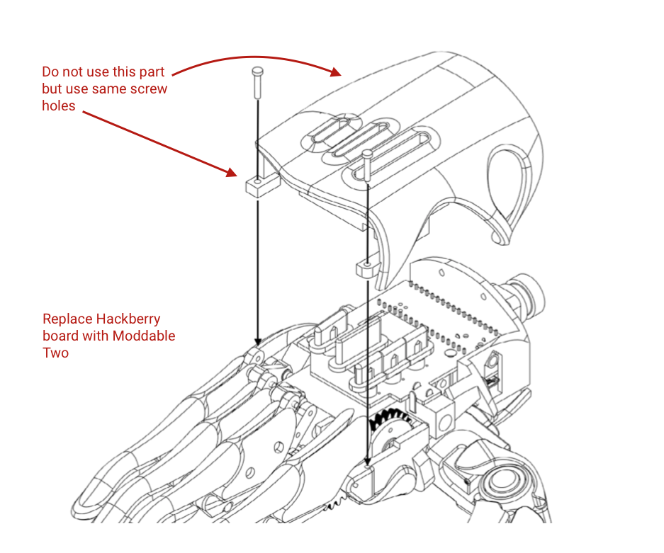
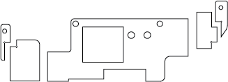
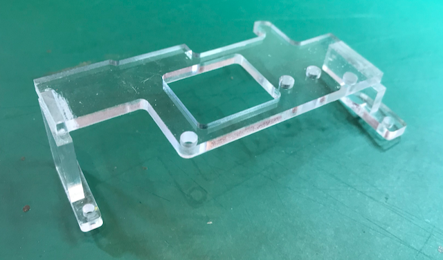
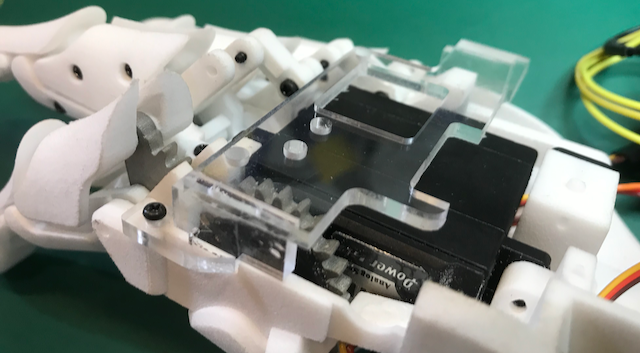
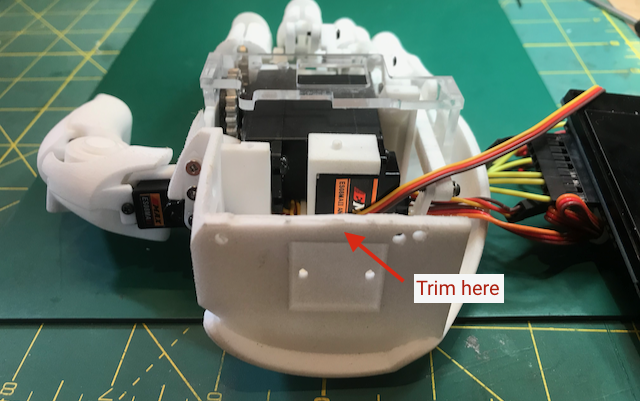
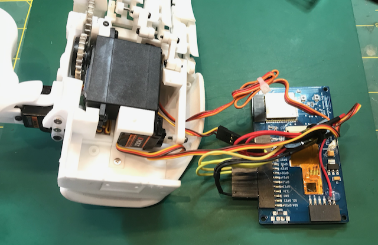
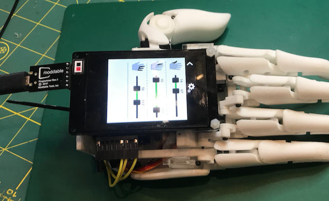
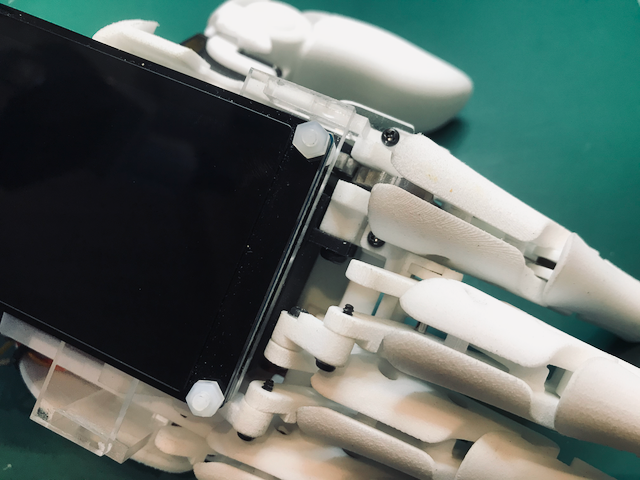
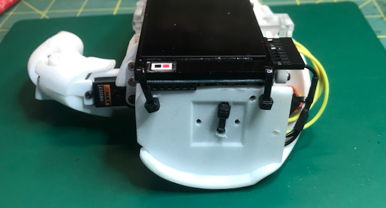

# Assembly Instructions

Copyright 2020 Moddable Tech, Inc. 
Revised: March 20, 2020

This document contains assembly instructions for Moddable's Hackberry Hand project. This project replaces the standard Hackberry MK2 board with a Moddable Two.

### Step 1 - Build Hackberry hand

We purchased the [Electrical/Mechanical Parts] (https://docs.google.com/forms/d/e/1FAIpQLSdaEcsGY5w2Oz1cYvZdZzNj4Mi7tRnYp-7VutEzGSIOJbIaeg/viewform?entry.1210761575=0%E5%80%8B&entry.1614602865=0%E5%80%8B&entry.843753756=0%E5%80%8B&entry.1139159705=0%E5%80%8B&entry.1297755053=0%E5%80%8B&entry.201222397=0%E5%80%8B) from Hackberry and printed the open-source [hand parts](https://github.com/mission-arm/HACKberry) we needed with 3D printing vendor [Xometry] (https://Xometry.com) in Nylon 12 using SLS technology.

Assemble the bottom part of the Hackberry hand following the instructions from Hackberry. An English version is available [here](./HACKberryHANDBOOK_100517_ver.7.1_en.pdf).

### Step 2 - Build platform

Create a platform to integrate the flat Moddable Two into the curvilinear form of the Hackberry. You can download the .svg file of our platform parts [here](./hackberry-platform.svg). We made our platform with .125" acrylic.

Glue the pieces together as shown in the image below.

Screw the platform onto the hand. The image below shows the final result.

> Note: The Hackberry 3d parts are open source and could be modified to support the Moddable Two. We decided that creating a platform of custom cut acrylic pieces would be fast and allow us to create a very low profile integration of the Moddable Two. We milled the parts on a Bantom Tools CNC, but they could be laser cut just as well.

### Step 3 - Modify hand parts

Trim the back of the hand to the level of the platform and drill holes to allow for zip tie attachment.
    

### Step 4 - Hookup

We powered our hand from a 5V micro USB source. We used the same ground and power for all three servos. 

The servo signal wires are attached to the Moddable Two pinouts as follows: 

- Thumb: GPIO 27
- Index: GPIO 32
- Other fingers: GPIO 33

We made the wire connection removable, but the 5V conflicted with the "other fingers" linkage, and we ended up fly-wire soldering the servo power lead to a 5V pad on the PCB.

All dupont connections were taped, and wires were bundled and zip-tied to keep them compact.

### Step 5 - Final assembly 

The Moddable Two is attached to the platform by 2.5mm nylon bolts in the front and zip ties in the back. The bolts need to have the heads underneath for clearance. At this point, you can power the hand from the micro USB port or a Moddable programmer. 

After installing the [sample hand app](../app), use the settings panel to set the range of motion for each finger group so that the servos don't strain against the linkage the end of the linkage movement.

